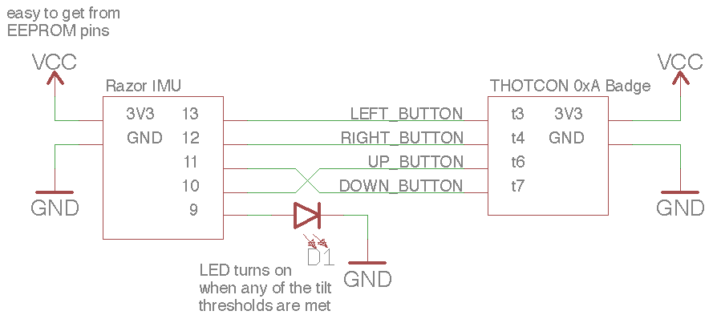

# thotcon 0xA badge hack: Thot it!

A fast-paced game similar to [Bop it!](https://en.wikipedia.org/wiki/Bop_It), where the player must quickly tilt the badge to the intended side before time runs out!

The badge communicates the intended tilt direction in two ways, with the LEDs and audio commands:

```
Hack it: backward
Crack it: left
Thot it: forward
Attack it: right
```

To start the game, press the left-most capacitive touch button (select).

...But beware! The further you progress, the faster the game will speed up, so don't slip up!

### Installation

This badge hack requires an accelerometer to be added to the badge to detect tilt direction. Given limited time and supplies, a [SparkFun 9DoF Razor IMU M0](https://www.sparkfun.com/products/14001) was used for its accelerometer readings. Ideally, an SPI accelerometer would be added to the board since the SPI pins could be broken out from the badge's EEPROM.

The Razor IMU needs to be loaded with its own firmware that simply polls the accelerometer and pulls one of four GPIOs high if the board is tilted to a certain degree on a certain side. These GPIOs (13, 12, 11, and 10) are attached to the badge by severing (thinking now, this probably was not necessary, the traces just need the soldermask scraped off for connecting) four of the cap touch traces (t3, 4, 6, and 7) and repurposing them as inputs to check the tilt status of the IMU. Use the schematic below as guidance for connecting the pins.

